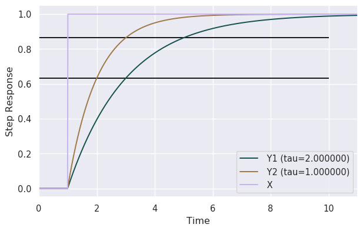
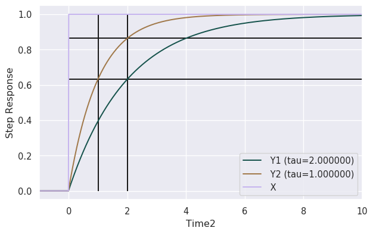
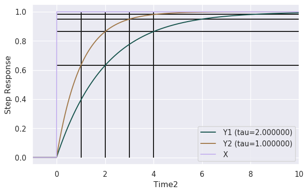

```python
import numpy as np
import pandas as pd
import seaborn as sns
import matplotlib.pyplot as plt

import IPython.display as display
```


```python
sns.set(
    rc={
        "figure.figsize": (4.5*1.61803398875, 4.5), # Half page wide with 0.5 left * right margins. 
        "figure.dpi": 96,
        "figure.facecolor": "w",
        "figure.edgecolor": "k",
    }
)
# The cubehelix color palette system makes sequential palettes with a linear increase or decrease in brightness and some variation in hue. This means that the information in your colormap will be preserved when converted to black and white (for printing) or when viewed by a colorblind individual.
sns.palplot(sns.color_palette("cubehelix", 3))
sns.set_palette(sns.color_palette("cubehelix", 3))
```


```python
df = pd.read_csv("step_output.csv")
```


```python
df.columns
```


    Index(['Time', ' X', ' Y1 (tau=2.000000)', ' Y2 (tau=1.000000)'], dtype='object')


```python
df['Time2'] = df.Time-1
```


```python
ax = df.plot(x='Time', y=[' Y1 (tau=2.000000)', ' Y2 (tau=1.000000)', ' X'])
plt.ylabel("Step Response")
plt.hlines(1-np.exp(-1), 0, 10)
plt.hlines(1-np.exp(-2), 0, 10)
```


    <matplotlib.collections.LineCollection at 0x7f7ed61dbfa0>





```python
ax = df.plot(x='Time2', y=[' Y1 (tau=2.000000)', ' Y2 (tau=1.000000)', ' X'])
plt.ylabel("Step Response")
plt.hlines(1-np.exp(-1), 0, 10)
plt.hlines(1-np.exp(-2), 0, 10)
plt.vlines(1, 0, 1)
plt.vlines(2, 0, 1)
```


    <matplotlib.collections.LineCollection at 0x7f7ed5a2c430>





```python
ax = df.plot(x='Time2', y=[' Y1 (tau=2.000000)', ' Y2 (tau=1.000000)', ' X'])
plt.ylabel("Step Response")
for tc in [1, 2, 3, 4]:
    plt.hlines(1-np.exp(-tc), 0, 10)
    plt.vlines(tc, 0, 1)
```





```python

```


```python
df["Time2"][df[" Y2 (tau=1.000000)"]<(1-np.exp(-1))]
```


    0     -1.00
    1     -0.99
    2     -0.98
    3     -0.97
    4     -0.96
           ... 
    195    0.95
    196    0.96
    197    0.97
    198    0.98
    199    0.99
    Name: Time2, Length: 200, dtype: float64


```python
df["Time2"][df[" Y2 (tau=1.000000)"]>(1-np.exp(-1))][200]
```


    1.0


```python

```
